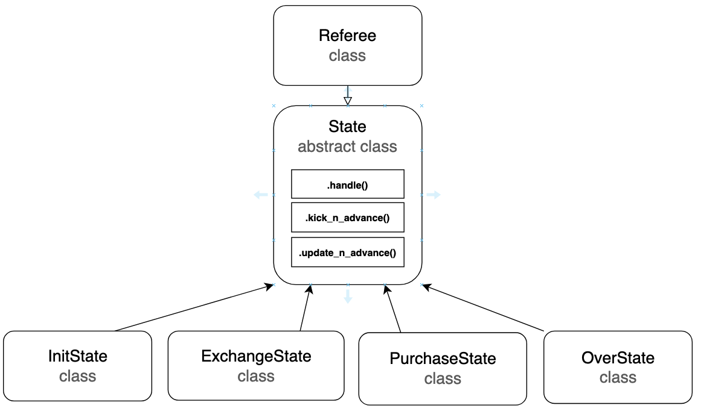
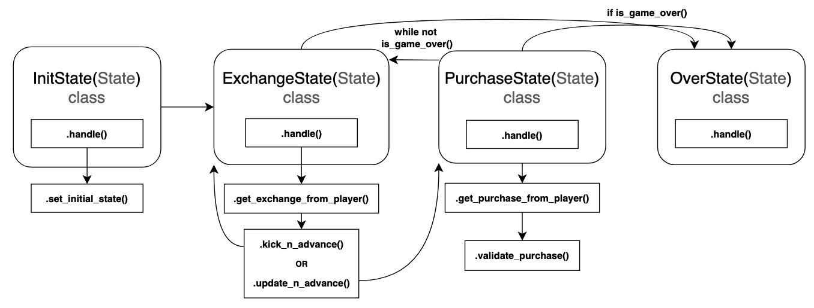

# Directory 7

## Purpose
The main component of this directory is the _xgames_ test harness. The harness consumes JSON input from STDIN and produces results to STDOUT. There are also ten sample tests for the _xgames_ harness in the ./Tests folder.

## Files and directories:
- **\_\_init\_\_.py**: marks this directory on disk as a Python package directory
- **./Makefile**: sets up the python environment with all necessary packages for the Bazaar Game to be run.
- **./requirements.txt**: packages required for Bazaar to run.
- **./xgames**: executable file for the test harness. Expects inputs from STDIN when started and outputs to STDOUT when finished. 
  - The input to _xgames_ consists of *Actors, representing the actual players; the (maximally useful) *Equations; and a Game state.
  - The output of _xgames_ consists of two arrays: the first contains the alphabetically sorted (string<=?) ActorNames, of winners and the second the alphabetically sorted ActorNames of dropout players.
- **./Tests**: directory containing tests as a .json file pairs. For each test case n, there are two test files: n-in.json with given input, and n-out.json with expected output for that input.

## Class Diagram

## State Machine Chart
