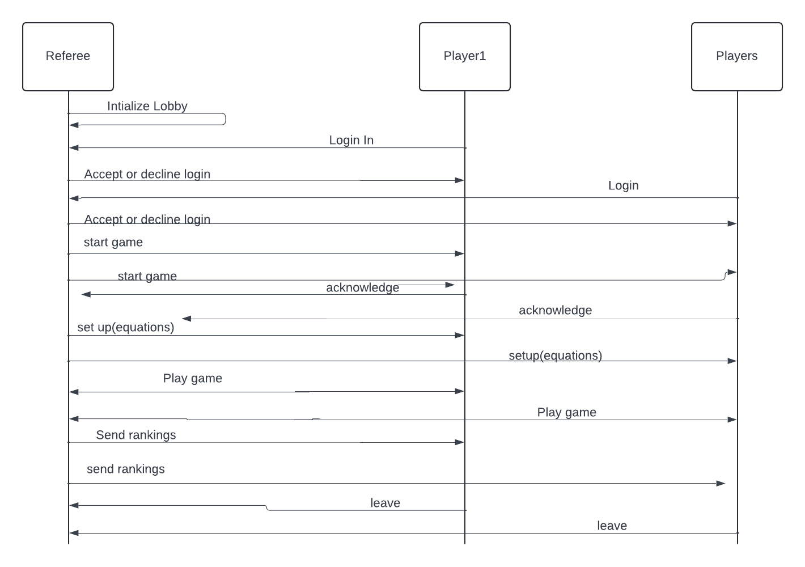

# Remote

**TO**: Co-Ceo

**FROM**: James Quinlivan, Arthur Efremenko

**CC**: CS4500 TAs

**DATE**: November 5, 2024

**SUBJECT**: Remote Protocol

### Steps
1. The server creates a lobby for players to join (starts accepting TCP connections from remote players). 
2. Players send a message to the server with a login information, name/unique identifier.
3. The server initializes a Mechanism instance for each player with unique names, sends a message back either accepting, with a welcome message, or decline to the player.
4. The server waits for other players to join, following steps 2 and 3.
5. Once max players are reached or the time-out, the players are sent over to the referee. 
6. The referee fills the lobby with house players if the lobby is not full.
7. Referee begins its setup: generates equations and game state, sends a setup message to players 
8. Players who failed to perform a setup are kicked.
9. The referee runs the game until completion as outlined in previous memos.
10. At the end of the game the referee notifies each player in the game of their win/lose status.
11. The referee sends the game over signal to all observers and shuts down/deconstructs.
12. The server closes the TCP connection with all players.

NOTE: each of these steps will involve additional checks for validity of JSON received from the players.
The server must not go down because of invalid JSON appearing in any of the interactions.