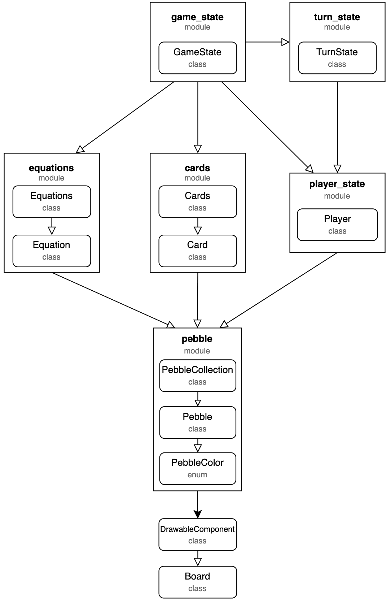
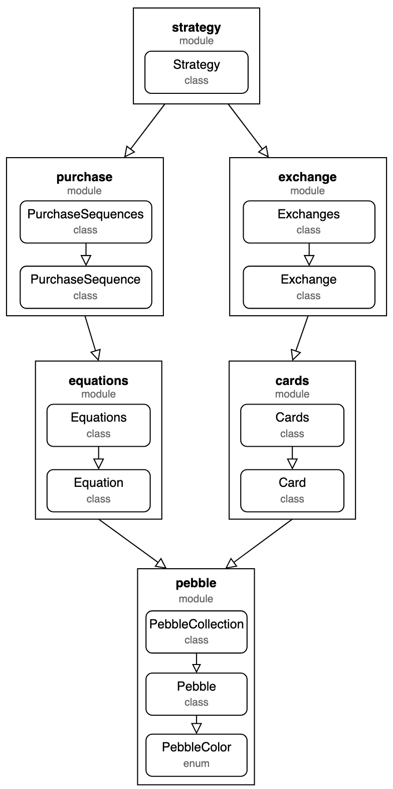

# Directory _Bazaar_

## Purpose
Holds the source code for the Bazaar game.

## Files and Directories:

- **\_\_init\_\_.py**: marks this directory on disk as a Python package directory
- **./Makefile**: sets up the python environment with all necessary packages for the Bazaar Game to be run.
- **./requirements.txt**: packages required for Bazaar to run.
- **./Common**: Directory containing files that contains models to be shared by multiple files in this project.
- **./Planning**: Directory containing files for sprint plans and data modeling ideas.
- **./Referee**: Modules needed for the referee to run the game.
- **./Player**: Modules available to the player playing the game.

To run the tests, run the files beginning with "test" with Python. E.g. ``python3 ./Referee/testGameState.py``.

### Game State Diagram:

### Strategy Diagram
